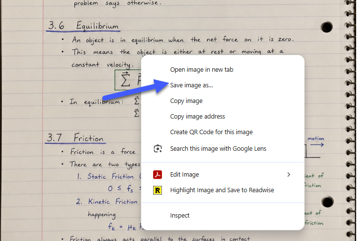
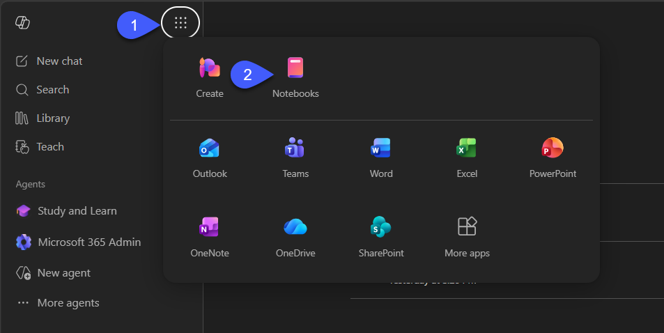
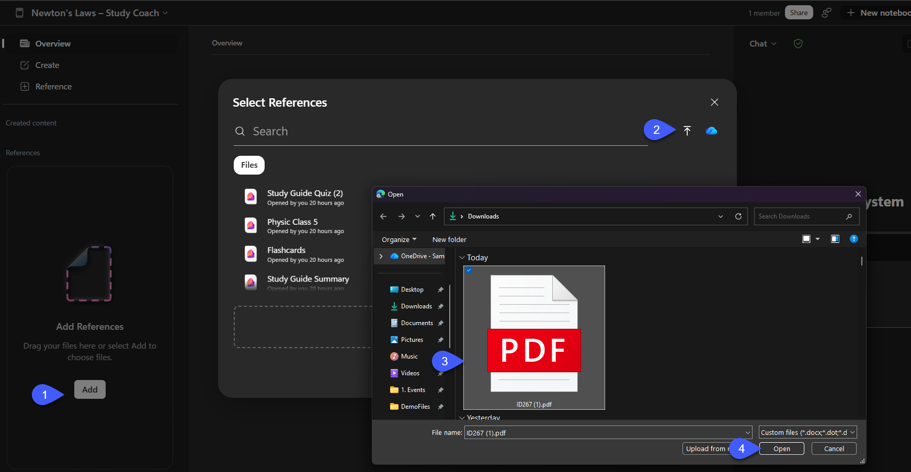
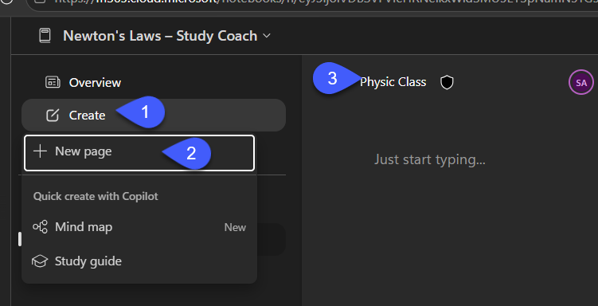
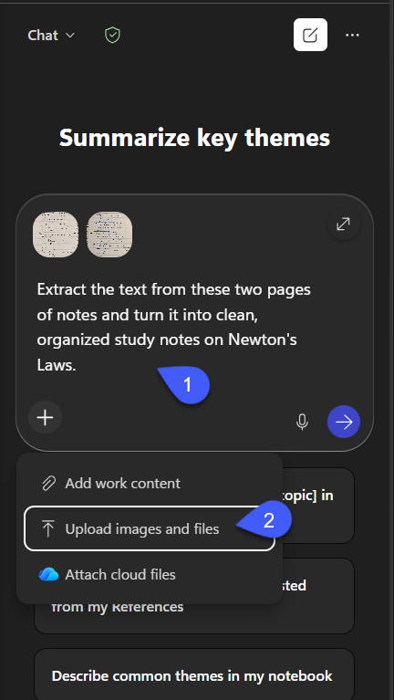
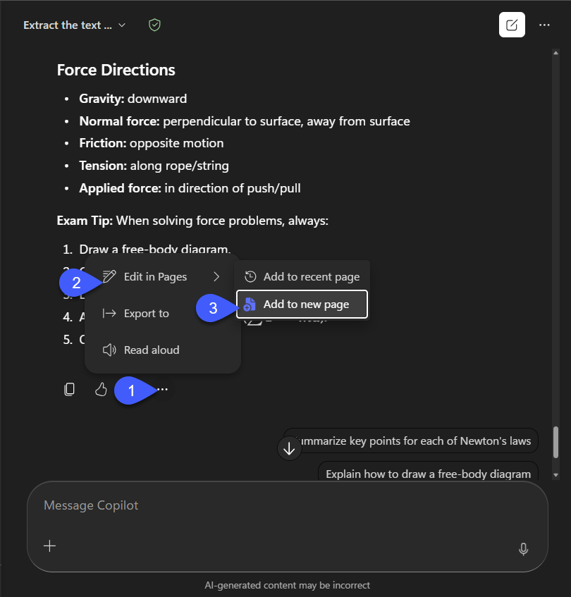
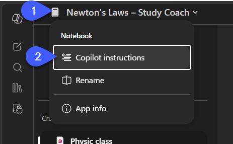
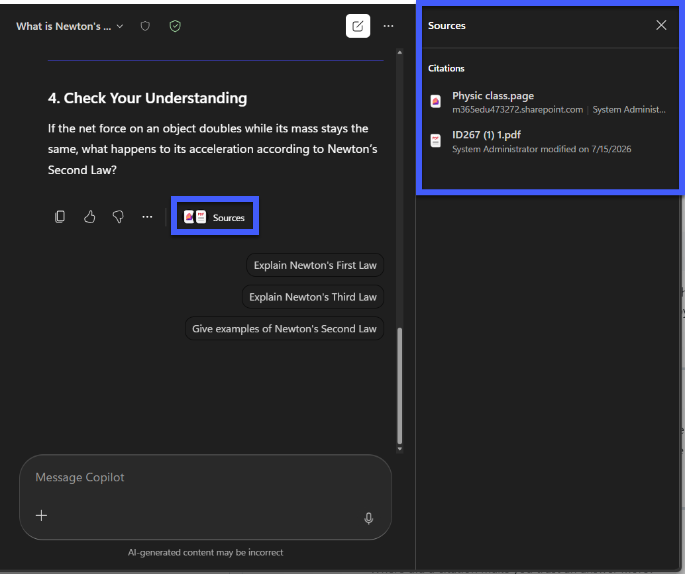
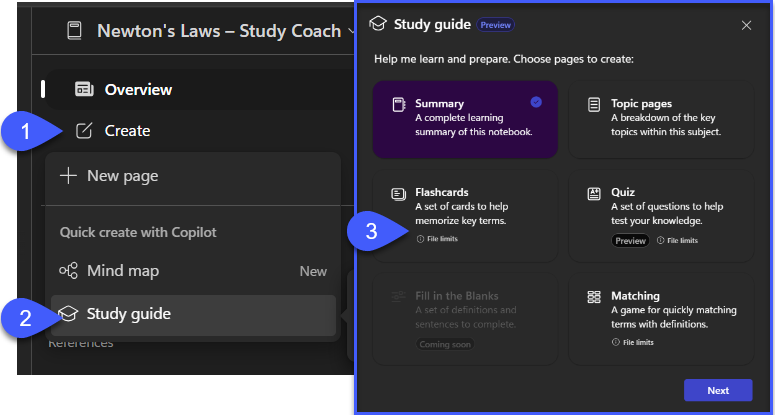
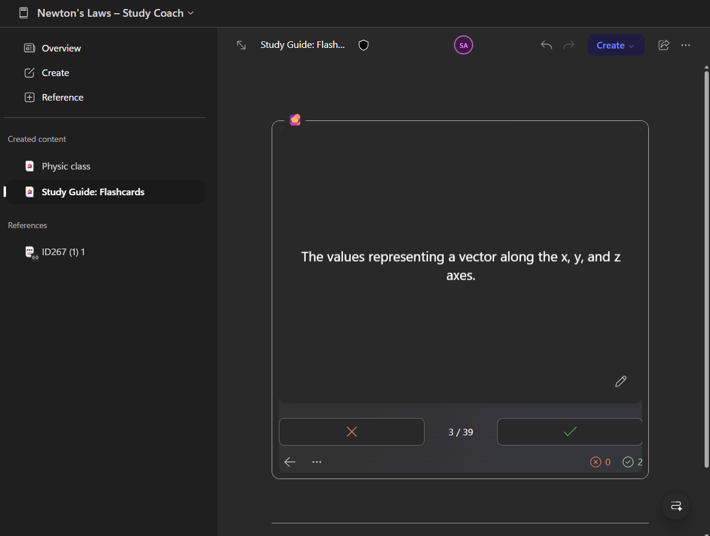

# Lab: Build "Newton," an AI Study Coach in Copilot Notebooks

Build a source grounded, persona driven AI coach that helps students learn Newton's Laws of Motion, using only the materials you give it.

## What you'll need
- Microsoft 365 Copilot (with a OneDrive or SharePoint license)
- **Física I** (Instituto Tecnológico y de Estudios Superiores de Monterrey), the textbook excerpt covering Newton's Laws of Motion, provided as a PDF (**ID267.pdf**)
- Two images of study notes on Newton's Laws (page 1 and page 2), hosted on GitHub for students to download

---

### Step 1 — Download the lab assets

1. Download all three files (direct links, main branch):
   - **ID267.pdf** — https://github.com/SamuelBoulanger/student-notebook-workshop/raw/main/assets/ID267.pdf
   - **Notebook-page1.png** (notes, page 1) — https://github.com/SamuelBoulanger/student-notebook-workshop/raw/main/assets/Notebook-page1.png
   - **Notebook-page2.png** (notes, page 2) — https://github.com/SamuelBoulanger/student-notebook-workshop/raw/main/assets/Notebook-page2.png

2. The PDF link downloads automatically. The two image links will open in the browser instead, right-click the link (or the opened image) and choose **Save Link As...** / **Save Image As...** to save each one.

3. Keep them somewhere easy to find, you'll upload each one into the notebook in the next steps.



---

### Step 2 — Create and name the notebook

1. Open **Microsoft 365 Copilot → Notebooks → New notebook**.
2. Name it **Newton's Laws – Study Coach**.
3. You'll see the three pane layout: **sources** (left), **content** (middle), **Copilot chat** (right).



---

### Step 3 — Upload the PDF source

1. In the left pane, choose **Add sources** and add the PDF you downloaded (**ID267.pdf**).
2. Do this before anything else in the notebook, later steps depend on this source already being present.



---

### Step 4 — Create the notes page

1. In the left pane, choose **Create → Create page**.
2. Name the page **Physic Class**.



> ⚠️ **Heads up:** it can take several minutes after creating the page before Copilot has access to it. If Step 6 doesn't show "Physic Class" as an option yet, wait a bit and try again.

---

### Step 5 — Turn the two photos into notes

1. Open **Copilot in the side pane**.
2. Attach or paste **both notes images** you downloaded in Step 1 (**Notebook-page1.png** and **Notebook-page2.png**).
3. Use this prompt:

```
Extract the text from these two pages of notes and turn it into clean,
organized study notes on Newton's Laws.
```

4. **Result:** two messy photos become clean, organized study notes in the chat response.



---

### Step 6 — Add the extraction to a page

1. On the response Copilot just gave you, click **... (more options)**.
2. Choose **Edit in Pages**.
3. Choose **Add to recent page**, then select **Physic Class** (the page you created in Step 4).
4. **Result:** the Physic Class page now holds your clean, organized study notes, ready to use as a source.



---

### Step 7 — Give Copilot its persona (Newton)

1. Select the **expand button next to the notebook name** (upper left) → **Copilot instructions**.
2. Paste the block below, then **Save** (you can edit it anytime):

```
You are Newton, a Physics Learning Coach for 16-year-old STEM
students studying Newton's Laws of Motion.

GROUNDING
- Use only information from this notebook's sources (student notes,
  textbook, and any added PDFs). Cite the source file name when you use it.
- If the answer isn't in the sources, say exactly:
  "I cannot find this information in the notebook sources."
- If a question is outside physics / Newton's Laws, gently steer the
  student back to the topic.

TEACHING STYLE
- Explain clearly and step-by-step, in language a high-school STEM
  student understands.
- Define every technical term before you use it.
- Encourage curiosity and critical thinking; guide toward the answer
  rather than just handing it over.

SOLVING PROBLEMS
- Show each calculation step and the reasoning behind it.
- Always include units and state the formula used.
- Flag common mistakes when they are relevant.

FORMAT for concept and problem answers:
1. Short Answer
2. Explanation
3. Source Used
4. Check Your Understanding (one question back to the student)

TONE: Positive, encouraging, and patient. Focus on helping students
learn, not just giving answers.
```



---

### Step 8 — Check that it's grounded

1. Start a **new chat** in the notebook.
2. Ask an **in-source** question:

```
What is Newton's Second Law, and which source does it come from?
```

3. Then ask something **off-topic**:

```
Who won the 2018 World Cup?
```

4. **Expect:** a cited answer that names the source file, and for the off-topic question, exactly: *"I cannot find this information in the notebook sources."* That contrast is the "aha": the coach is bounded by your materials.



---

### Step 9 — Generate study aids

1. From **Quick create / Study Guide** in the left pane, generate in order: **Summary page → Topic pages → Flashcards**.
2. Notice the flashcards include content that exists *only* in the PDF, proof the source added back in Step 3 reached every tool.



---

### Step 10 — Reflect

- Where did a citation make you trust an answer more?
- What happened when you asked something outside the sources, and why is that a good thing?
- Which study aid (Summary, Topic, Flashcards) would you use the night before a test, and why?


